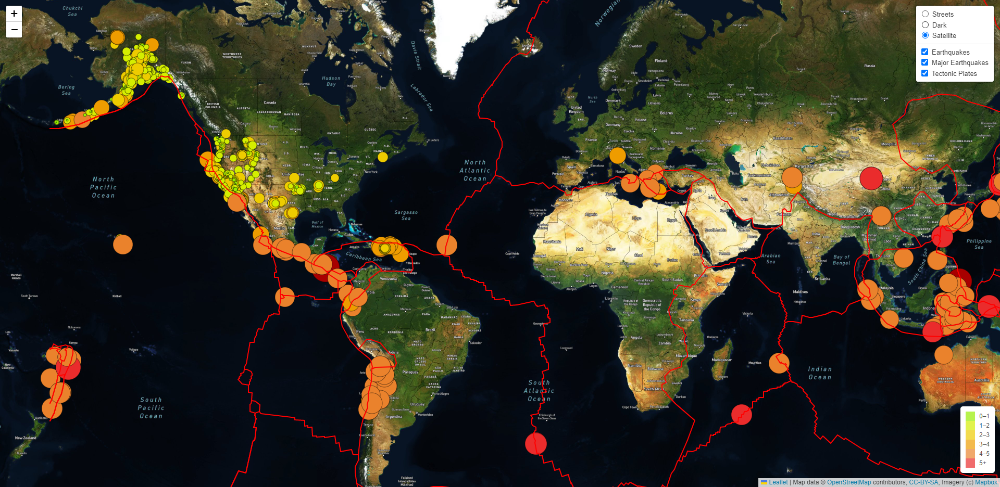

# Mapping GeoJSON data with JavaScript

## Overview: 
In this project, we used the Mapbox API to build a beautiful, interactive `.map` with multiple `.tileLayer` plotting various GeoJSON FeaturesCollection Objects.

### Earthquakes
We used `.circleMarker`s to show the locations of all earthquakes occurring in the last 7 days (GeoJSON `Point`), with the color and size of the circles corresponding to their magnitudes. Then, with the `.onEachFeature` method, we used the `.bindPopup` method to add a popup box to each circle (when clicked) telling users the earthquake magnitude, and approximate location. We then created two separate `.layerGroup()` for 'all' earthquake data, versus only the 'major' earthquakes, and added both as select-able 'overlays' to be viewed top of our 'baseLayer' map.

At the bottom right of the screen, we have also included a Legend using `.DomUtil` to create an 'info legend' `
` tag and using JavaScript to iterate through predefined earthquake magnitudes, and adding `<i>` tags for each magnitude range and color.

### Tectonic Plates
Finally, we plotted the Tectonic Plate lines (GeoJSON `LineString`) as an additional `.layerGroup()` on our map, which can be toggled on top of our earthquake markers.

 

## Tools
1. Mapbox API (https://www.mapbox.com/)
2. JavaScript
    - D3.js
    - Leaflet.js
3. GeoJSON Data
    - Earthquake Data obtained from [USGS](https://earthquake.usgs.gov/)
    - Tectonic Plate Data obtained from GitHub user: [fraxen](https://github.com/fraxen/tectonicplates/tree/master/GeoJSON)

